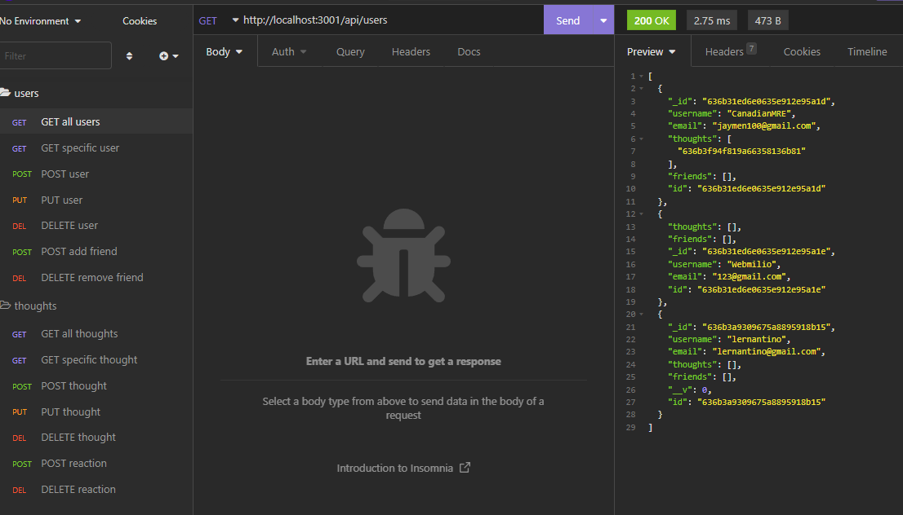

# User Thought App

## Description
This program allows you to create, add and remove users from a comment and post based system. You can create thoughts using routes in insomnia. See installation for info.

## Installation
[Demonstration Video](https://drive.google.com/file/d/1lmGcCxwoHDAIh9HQ8VDJeK4O03R5f8aO/view)

## Usage
[Demonstration Video](https://drive.google.com/file/d/1lmGcCxwoHDAIh9HQ8VDJeK4O03R5f8aO/view)

## Credits
Jaymen Laton
[Github Repo](https://github.com/CanadianMRE/thoughts)

## License
None

## Questions
Visit my github at [CanadianMRE](https://github.com/CanadianMRE)
or
Contact me through email at jaymen100@gmail.com
